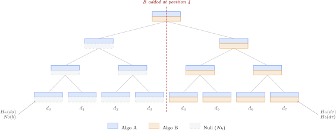
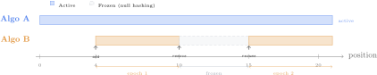
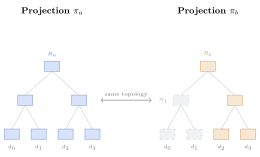

## Design Paradigm and Architectural Topology {#sec-architecture}

This section introduces the Polymorphic Merkle Log (PML) paradigm and its concrete Epoch Merkle Log (EML) construction informally. The formal algebraic model follows in §[IV](#sec-formal-model).

### Shared Topology

A PML is a single binary Merkle tree. Every registered algorithm
observes the same tree topology---the same number of leaf positions, the
same branching structure, the same internal node relationships (as illustrated in Figure 1). What
differs across algorithms is the *value* computed at each node: each
algorithm hashes every position independently using its own hash
function.

This is not one tree per algorithm. It is a single, unified data structure with multiple projections. While storing distinct internal node hashes for each algorithm is storage-equivalent to parallel logs, this shared-topology model yields three structural advantages over running disjoint logs:

1. **Timeline Continuity and Shared Sequencing:** The log enforces a single, globally ordered index space. Index $n$ under algorithm $a$ represents the exact same entry and transaction timeline as index $n$ under algorithm $b$. This eliminates coordinate fragmentation, allowing applications to reason about strict, chronological ordering across different cryptographic epoch transitions.
2. **Atomic Write Coordination:** A single append operation updates the logical state of the log atomically across all active projections, ensuring they can never diverge or drift out of sync.
3. **Consolidated Auditing Complexity:** Auditors and monitors watch a single log identity. Equivocation on any projection is immediately detectable as a split-view of the same shared logical sequence, bypassing the complexity of reconciling separate, asynchronous log timelines.

### Null Constants

When a new algorithm $a$ is added to a log that already contains $n$
entries, the algorithm must account for positions $0$ through $n-1$
without re-hashing any historical data. The EML accomplishes this
through *null constants*: per-algorithm, per-height deterministic values
that occupy inactive positions.

The null leaf constant for algorithm $a$ is:

$$
N_0(a) = H_a(\mathtt{0x02})
$$ {#eq-null-leaf}

The prefix byte $\mathtt{0x02}$ is distinct from both the leaf prefix
$\mathtt{0x00}$ and the node prefix $\mathtt{0x01}$, establishing a
third domain through the same single-byte mechanism used by RFC 9162. No
additional payload is required---domain separation is achieved by the
prefix alone.

Null constants propagate upward through the tree deterministically. A
subtree of $2^h$ null leaves has root:

$$
N_h(a) = H_a(\mathtt{0x01} \concat N_{h-1}(a) \concat N_{h-1}(a))
$$ {#eq-null-subtree}

Because every null leaf is identical, null subtrees are perfectly
symmetric. The entire table $\{N_0(a), N_1(a), \ldots, N_H(a)\}$ is
precomputable in $\mathcal{O}(H)$ hash operations, where
$H = \lceil \log_2 n \rceil$.

```{=html}
<figure id="fig-topology">
  
  <figcaption><strong>Figure 1.</strong> An 8-leaf PML with two algorithms. Algorithm A (blue) is active from genesis. Algorithm B (amber) was added at position 4; its pre-activation positions are filled with null constants (gray, dashed). Each node computes independent hash values per algorithm over a shared topology.</figcaption>
</figure>
```

### Leaf Value Function

The value at tree position $i$ for algorithm $a$ is:

$$
V(a, i) = \begin{cases}
  H_a(\mathtt{0x00} \concat \text{data}[i]) & \text{if } a \text{ is active at } i \\
  N_0(a) & \text{otherwise}
\end{cases}
$$ {#eq-leaf-value}

This is the central definition. Active positions receive the standard
RFC 9162 leaf hash of the raw data. Inactive positions receive the null
constant. The tree topology is dense---every position is filled---but the
*semantic content* is sparse in the temporal dimension for newly added
algorithms.

### Epochs

An algorithm's lifetime within the log is partitioned into *epochs*:
disjoint chronological intervals $[(s_1, e_1), (s_2, e_2), \ldots]$
during which the algorithm actively hashes appended data. Between epochs,
the algorithm is frozen: its root and frontier state are immutable, and
new appends produce null constants in its projection.

Three lifecycle operations govern epochs:

- **`add_alg`$(a)$**: Registers algorithm $a$ with initial epoch
  $[n, \infty)$, where $n$ is the current tree size. The algorithm's
  frontier is initialized to the *null prefix peaks*: the Merkle mountain
  range (MMR) peaks of $n$ null leaves, each computable as a NullTable
  lookup. Cost: $\mathcal{O}(\log n)$.

- **`remove_alg`$(a)$**: Closes $a$'s current epoch at the current tree
  size. The algorithm's frontier and root are frozen; future appends do
  not update them. Cost: $\mathcal{O}(1)$.

- **`resume_alg`$(a)$**: Reopens a frozen algorithm by appending a new
  epoch $[n, \infty)$. The frontier stack is reconstructed for the
  current tree size $n$ by decomposing $n$ into its binary
  representation and resolving each complete subtree root---via stored
  nodes, the NullTable, or recursive binary splits for mixed boundary
  subtrees. Cost: $\mathcal{O}(\log n)$. Resume provides operational
  flexibility to temporarily freeze inactive algorithms (saving write I/O
  and database storage during quiet periods) and resume them later if
  verification demand or compliance mandates change, paying a one-time
  $\mathcal{O}(\log n)$ reconstruction cost.

```{=html}
<figure id="fig-epochs">
  
  <figcaption><strong>Figure 3.</strong> Algorithm lifecycle in the EML. Algorithm A is active from genesis. Algorithm B is added at position 4, removed at position 10 (entering a frozen state where null hashing continues), and resumed at position 15. Each active interval defines an <em>epoch</em>; the frozen gap preserves tree-wide append consistency.</figcaption>
</figure>
```

### One Tree, Many Projections

The *projection* of the PML onto algorithm $a$ yields a sequence of
leaf values:

$$
\pi_a(\text{PML}) = [V(a, 0),\ V(a, 1),\ \ldots,\ V(a, \text{tree\_size}(a) - 1)]
$$

This sequence is a valid input to the standard RFC 9162 MTH construction.
The root computed from this projection equals the root maintained by the
EML's incremental frontier for algorithm $a$. From the perspective of a
verifier holding a single algorithm's root hash and proof, the EML is
indistinguishable from a standard single-algorithm Merkle tree.

Other algorithms are invisible. SHA-256's proofs never reference
BLAKE3's hashes. BLAKE3's proofs never reference SHA-256's. The
algorithms share topology but not trust.

### Non-Negotiable Agility and Downgrade Resistance

Traditional cryptographic agility designs (such as those in TLS cipher suite negotiation or JSON Web Tokens) rely on dynamic, runtime algorithm negotiation. This dynamic negotiation introduces a significant attack surface: an adversary capable of altering network packets can intercept the handshake and inject weaker algorithms, forcing a client to downgrade its cryptographic security level.

The EML design neutralizes downgrade attacks by completely eliminating runtime algorithm negotiation. Instead of relying on client-server negotiation during verification, the EML binds algorithm lifecycles directly to the log's root of trust via the epoch manifest. This manifest (Definition 8, §[IV](#sec-formal-model)) is committed in the Signed Tree Head (STH) signed by the log operator. Because client verification enforces that the active epochs for any algorithm match this immutable manifest, any attempt by an adversary to present a downgraded algorithm configuration or forge inactivity at an active position is immediately detected as a signature mismatch or tree-head equivocation.

```{=html}
<figure id="fig-projection">
  
  <figcaption><strong>Figure 2.</strong> Projection view of the PML from Figure 1. Left: Algorithm A's projection — a standard Merkle tree with all positions active. Right: Algorithm B's projection — positions 0–3 are null constants (N<sub>h</sub>), positions 4–7 are active. Each projection is an independently valid Merkle tree; proofs are generated per-projection.</figcaption>
</figure>
```

```{=latex}
\begin{figure*}[t]
  \centering
  \resizebox{\textwidth}{!}{\input{figures/fig-topology.tex}}
  \caption{An 8-leaf PML with two algorithms. Algorithm~A (blue) is
  active from genesis. Algorithm~B (amber) was added at position~4;
  its pre-activation positions are filled with null constants (gray,
  dashed). Each node computes independent hash values per algorithm
  over a shared topology.}
  \label{fig:topology}
\end{figure*}
```

```{=latex}
\begin{figure}[t]
  \centering
  \resizebox{\columnwidth}{!}{\input{figures/fig-projection.tex}}
  \caption{Projection view of the PML from Figure~\ref{fig:topology}. Left:
  Algorithm~A's projection --- a standard Merkle tree with all positions
  active. Right: Algorithm~B's projection --- positions 0--3 are null
  constants ($N_h$), positions 4--7 are active. Each projection is an
  independently valid Merkle tree; proofs are generated per-projection.}
  \label{fig:projection}
\end{figure}

\begin{figure}[t]
  \centering
  \resizebox{\columnwidth}{!}{\input{figures/fig-epoch-timeline.tex}}
  \caption{Algorithm lifecycle in the EML. Algorithm~A is active from
  genesis. Algorithm~B is added at position~4, removed at position~10
  (entering a frozen state where null hashing continues), and resumed at
  position~15. Each active interval defines an \emph{epoch}; the frozen
  gap preserves tree-wide append consistency.}
  \label{fig:epochs}
\end{figure}
```
