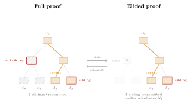

## Wire Optimization: Elided Proofs {#sec-elided-proofs}

The EML's shared topology introduces a proof size trade-off. In
independent per-algorithm trees, an algorithm active for $n_a$ appends
produces proofs of depth $\mathcal{O}(\log n_a)$. In the EML, proof
depth is $\mathcal{O}(\log n)$ where $n$ is the global tree size. When
$n_a \ll n$, EML proofs contain siblings that are *entirely composed of
null constants*---subtrees covering ranges where the algorithm was
inactive. These siblings are deterministically reconstructable by any
party that knows the epoch boundaries.

Elided proofs exploit this determinism to compress wire size from
$\mathcal{O}(\log n)$ to $\mathcal{O}(\log n_a)$, neutralizing the
shared-topology overhead.

### Null Sibling Detection via Interval Arithmetic

Given a proof for algorithm $a$ at leaf index $m$ in a tree of size $n$,
each sibling in the proof path covers a contiguous range of leaf
positions $[lo, hi)$. The prover (or an intermediate envelope layer)
determines whether a sibling is null by checking:

$$
\neg\text{active\_range}(a, lo, hi) \implies \text{sibling is null}
$$

If the range $[lo, hi)$ overlaps no active epoch of algorithm $a$, the
entire subtree consists of null constants. The sibling's hash is fully
determined by its height and the algorithm's null constant table.

### The Elision Protocol

The proof compression operates in three phases:

1. **Generation (server).** The server generates the full RFC 9162
   inclusion proof via the standard `subtree_root` engine
   (§[V](#sec-proof-engine)). All $\lceil \log_2 n \rceil$ siblings are
   present.

2. **Elision (server or envelope).** For each sibling in the proof path,
   compute the sibling's leaf-coverage range $[lo, hi)$. If
   $\neg\text{active\_range}(a, lo, hi)$, omit the sibling from the wire
   payload. The resulting *elided proof* contains only siblings whose
   subtrees intersect at least one active epoch.

3. **Rehydration (client).** The client walks the virtual tree path for
   index $m$ in a tree of size $n$. At each level, it computes the
   sibling's coverage range. If the range overlaps no active epoch, the
   client synthesizes $N_h(a)$ from its local NullTable. Otherwise, it
   consumes the next sibling from the elided proof's hash sequence.

4. **Verification (client).** The rehydrated proof is a standard
   RFC 9162 inclusion or consistency proof. It is passed to the
   unmodified cryptographic verification function (the PATH/SUBPROOF
   hash-chain walk); the verifier is unaware that elision occurred.
   The client pipeline as a whole is elision-aware (step 3), but the
   cryptographic core invoked at this step is not.

### Zero-Metadata Compression

The critical property of EML proof elision is that **no explicit
markers, bitmaps, or metadata are transmitted** to signal which siblings
were elided. Both the prover and verifier share:

- The global tree size $n$
- The leaf index $m$
- The algorithm's epoch list $\text{act}(a)$

These three values fully determine the tree path and, for each sibling
position, whether its coverage range intersects an active epoch. The
prover and verifier independently arrive at the same elision/rehydration
decisions. This stands in contrast to Sparse Merkle Tree proof
compression, which requires an explicit bitmap (typically 32 bytes) to
indicate which siblings in a 256-level proof are default values
[@laurie2012; @tari2018].

### Wire Size Analysis

Let $n$ be the global tree size and $n_a$ the number of positions where
algorithm $a$ was active ($n_a = \sum_{(s_k, e_k)} (e_k - s_k)$). The
full proof contains $\lceil \log_2 n \rceil$ siblings. Each null sibling
covers a range entirely outside $a$'s active epochs.

In the common case of a single contiguous epoch $[(s, \infty)]$:

- Siblings covering the null prefix $[0, s)$ are elided.
- Siblings covering the active and post-activation range are retained.
- The elided proof contains approximately $\lceil \log_2 n_a \rceil$
  siblings.

For algorithms with multiple disjoint epochs, the wire size is bounded
by $\mathcal{O}(\log n_a + k)$ where $k$ is the number of epoch
boundaries that fall within sibling coverage ranges. In practice, $k$ is
small relative to tree depth.

::: {#tbl-wire-comparison}
| Proof system | Wire size | Metadata overhead |
|:-------------|:----------|:------------------|
| RFC 9162 (standard) | $\mathcal{O}(\log n)$ hashes | None |
| SMT (bitmap compressed) | $\mathcal{O}(\log N_{\text{items}})$ hashes | 32-byte bitmap |
| EML (full proof) | $\mathcal{O}(\log n)$ hashes | None |
| EML (elided proof) | $\mathcal{O}(\log n_a)$ hashes | **None** |

: Wire proof size comparison. $n$: tree size. $n_a$: active entries for
the queried algorithm. $N_{\text{items}}$: non-empty entries in SMT.
:::

The EML's elided proofs achieve comparable compression to SMT bitmap
techniques but without transmitting any metadata. The verifier's
knowledge of the epoch boundaries is sufficient.

```{=latex}
\begin{figure*}[t]
  \centering
  \resizebox{0.85\textwidth}{!}{\input{figures/fig-elision.tex}}
  \caption{Proof elision. Left: a full inclusion proof for Algorithm~B
  at position~$d_2$ requires two siblings, including a null subtree
  root covering positions 0--1. Right: the elided proof omits the null
  sibling entirely; the verifier rehydrates it from the precomputed null
  table $N_h(b)$ using only the epoch boundary metadata.}
  \label{fig:elision}
\end{figure*}
```

```{=html}
<figure id="fig-elision">
  
  <figcaption><strong>Figure 4.</strong> Proof elision. Left: a full inclusion proof for Algorithm B at position d₂ requires two siblings, including a null subtree root covering positions 0–1. Right: the elided proof omits the null sibling entirely; the verifier rehydrates it from the precomputed null table N<sub>h</sub>(b) using only the epoch boundary metadata.</figcaption>
</figure>
```

