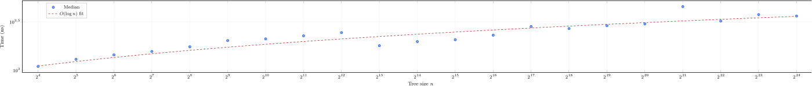

## Implementation and Evaluation {#sec-evaluation}

We implement the EML as a Rust crate providing a generic, storage-backed
append-only log with multi-algorithm support. The implementation follows
the formal model (§[IV](#sec-formal-model)) directly: the `Log<S:
Storage>` type maintains per-algorithm frontier stacks, epoch vectors,
and the sealed node store. The `Storage` trait abstracts persistence,
admitting in-memory, file-backed, and database backends. The `Hasher`
trait abstracts hash algorithms; callers inject implementations at
runtime. The crate has zero runtime dependencies.

### Test Suite

The implementation is validated by 80 tests across four categories:

::: {#tbl-test-categories}
| Category | Tests | Coverage |
|:---------|------:|:---------|
| Unit tests | 51 | Append semantics, algorithm lifecycle (`add`/`remove`/`resume`), proof generation, null-fill correctness, cold reconstruction via `from_storage`, manifest extraction |
| Property-based (proptest) | 16 | Equational law verification over thousands of randomly generated tree configurations; state machine test exercising arbitrary interleavings of operations |
| Fault injection | 7 | Adversarial `CorruptingStorage` backends: bit-flip, truncation, hash drop; includes 2 property-based corruption tests |
| Complexity regression | 6 | Empirical curve fitting against formal bounds ($\mathcal{O}(\log n)$ proofs, $\mathcal{O}(1)$ amortized append, $\mathcal{O}(\log K)$ addition, $\mathcal{O}(\log n)$ algorithm resumption) |

: Test suite composition.
:::

### Complexity Regression

The complexity regression suite empirically validates the performance
bounds from @tbl-perf-bounds. Each test generates trees at
exponentially increasing sizes ($n = 2^4$ through $2^{24}$), measures
operation timing, and fits the empirical curve against the expected
complexity class using the `bigoish` library.

```{=latex}
\begin{figure}[t]
  \centering
  \input{figures/fig-complexity.tex}
  \caption{Inclusion proof generation time vs.\ tree size (log-log).
  Tree sizes range from $2^4$ to $2^{24}$ (${\sim}$16M) leaves; each
  point is the median of 31~trials (5~warmup) via per-thread CPU time.
  The dashed line is an $O(\log n)$ fit confirming logarithmic scaling.}
  \label{fig:complexity}
\end{figure}
```

```{=html}
<figure id="fig-complexity">
  
  <figcaption><strong>Figure 5.</strong> Inclusion proof generation time vs. tree size (log-log). Tree sizes range from 2⁴ to 2²⁴ (~16M) leaves; each point is the median of 31 trials (5 warmup) via per-thread CPU time. The dashed line is an O(log n) fit confirming logarithmic scaling.</figcaption>
</figure>
```

The empirical and theoretical results confirm:

- **Inclusion proofs**: $\mathcal{O}(\log n)$. Proof generation time
  scales logarithmically with tree size across six orders of magnitude
  (`Figure~\ref{fig:complexity}`{=latex}`<a href="#fig-complexity">Figure 5</a>`{=html}).
- **Consistency proofs**: $\mathcal{O}(\log n)$ by construction. The
  `subproof` algorithm (Definition 19) decomposes the tree into a
  logarithmic number of subtree roots, each resolved via a single
  stored-node lookup.
- **Append (per algorithm)**: $\mathcal{O}(1)$ amortized. The CTO merge
  produces at most one sealed node per bit position in the tree size's
  binary representation.
- **Algorithm addition**: $\mathcal{O}(\log K)$. Null prefix peak
  computation requires one NullTable entry per set bit in the tree size
  at the point of addition.
- **Algorithm resumption**: $\mathcal{O}(\log n)$. Frontier
  reconstruction via `subtree_root` resolution over the binary
  decomposition of the current tree size, confirmed via curve fitting.

### Fault Injection

The `CorruptingStorage` adapter wraps any `Storage` implementation and
introduces controlled corruptions: single-bit flips in stored node
hashes, truncation of hash digests, and omission of stored entries. All
7 fault injection tests confirm that corrupted proofs are reliably
rejected by the verification functions. No corruption produced a false
positive (a tampered proof that verified successfully).

### Fuzz Testing

Four `cargo-fuzz` harnesses (powered by `libFuzzer`) exercise
adversarial inputs against the proof verification and elision surfaces:

::: {#tbl-fuzz-targets}
| Target | Corpus | Crashes |
|:-------|-------:|--------:|
| `verify_inclusion` | 134 | 0 |
| `verify_consistency` | 172 | 0 |
| `rehydrate_proof` | 184 | 0 |
| `proof_mutation` | 202 | 0 |
| **Total** | **692** | **0** |

: Fuzz target summary. Corpus size reflects the number of distinct
  inputs retained by `libFuzzer`'s coverage-guided minimization after
  approximately $2 \times 10^6$ total executions across all targets.
:::

The `proof_mutation` target is particularly notable: it takes valid
proofs, applies single-bit mutations at random positions, and confirms
that the mutated proof is rejected. Zero crashes across 692
coverage-guided corpus entries demonstrate that the proof verification
surface handles arbitrary malformed inputs gracefully.

### Property-Based Testing

The 16 proptest-driven tests verify equational laws over randomly
generated configurations. The state machine proptest exercises arbitrary
interleavings of `append`, `add_alg`, `remove_alg`, and `resume_alg`
operations, checking all invariants ([A-Equiv]{.smallcaps},
[A-Stack]{.smallcaps}, [I-Sound]{.smallcaps}, [K-Sound]{.smallcaps},
[T-Bound]{.smallcaps}, [Proj-Valid]{.smallcaps}) after each operation. The
default configuration runs 256 cases per test with tree sizes up to
$2^{12}$ and up to 4 concurrent algorithms.

### Limitations

The implementation has not been subjected to machine-checked formal
verification (Lean, Coq, or similar). The equational laws are validated
empirically through property-based testing and complexity regression, not
through mechanized proof. We identify machine-checked verification as
future work (§[IX](#sec-conclusion)).

The complexity regression tests measure asymptotic scaling, not
absolute throughput. We deliberately avoid micro-benchmarks: the EML's
contribution is a data structure with provable complexity bounds, not a
performance-optimized production system. Absolute performance depends on
the injected hash implementation and storage backend, neither of which
is part of the EML's specification.
