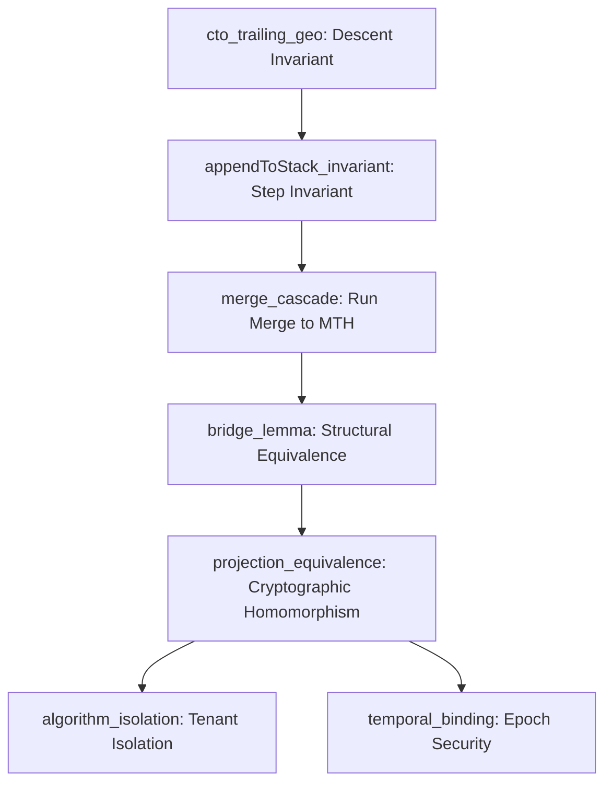

# EML Definitional Mapping and Proof Structure Companion

This document provides a side-by-side definitional mapping between the Lean 4 formalization and the Rust production implementation of the Epoch Merkle Log (EML). It also explains the structural proofs to facilitate the paper's integration.

## 1. Definitional Correspondence Audit

The following table maps the formal entities defined in the Lean 4 machine-checked proof (TCB/model) to their corresponding operational definitions and implementations in the Rust production codebase.

| Mathematical Entity (Lean 4) | Rust Implementation / Crate | Description |
| :--- | :--- | :--- |
| `MerkleTree α` (magma) | `struct MerkleTree` (internal logic) | Abstract structural tree decoupled from hash. |
| `mth` (Tree.lean) | `mthDigest` (test oracle) / batch computation | Batch Merkle Tree Hash construction (RFC 9162 §2.1). |
| `cto` (Tree.lean) | `count_trailing_ones` (src/log.rs) | Count trailing one-bits determining merge steps. |
| `buildStackAux` (Invariant.lean) | `append` loop CTO merge (src/log.rs) | Incremental bottom-up stack accumulator machine. |
| `leafValue` (Projection.lean) | `leaf_value` / `is_active_at` in `append` | Null-padded leaf or payload leaf hash generation. |
| `project` (Projection.lean) | `project` (src/log.rs) | Single-algorithm projection leaf digest sequence. |
| `subtree_root` (General/Duality.lean) | `subtree_root` / `sr` (src/proof.rs) | Operational O(log n) subtree root resolver. |

### Detail on `buildStackAux` vs. Rust `append` CTO Merge

In Lean 4, `buildStackAux` recursively folds and merges power-of-two subtrees based on the `cto` count:
```lean
def appendToStack (stack : List (MerkleTree α)) (x : MerkleTree α) (cto : Nat) : List (MerkleTree α) :=
  match cto, stack with
  | 0, _ => x :: stack
  | cto + 1, [] => [x] -- degenerate fallback
  | cto + 1, r :: l :: rest => appendToStack rest (node l r) cto
  | cto + 1, [single] => [x] -- degenerate fallback
```
In Rust, this corresponds directly to pushing the new leaf value to the stack and performing `merge_count` pop/merge/push operations inside `append` (src/log.rs):
```rust
state.stack.push(digest);
for j in 1..=merge_count {
    let right = state.stack.pop().expect("stack underflow");
    let left = state.stack.pop().expect("stack underflow");
    let parent = state.hasher.node(&left, &right);
    // ... persist sealed node ...
    state.stack.push(parent);
}
```

---

## 2. Proof Structure and Integration

The EML proof chain is structured in five logical phases to prove that bottom-up incremental stack construction is equivalent to top-down batch Merkle tree hashing.



### A. The Descent Condition (`cto_trailing_geo`)
Proving that the stack maintains descending power-of-two sizes requires showing that pushing a new leaf to a valid stack does not cause an out-of-bounds merge cascade. The Lean proof verifies this in `cto_trailing_geo` using a modular arithmetic contradiction: if a stack size configuration were degenerate, it would violate `n ≡ 2^(k+1) - 1 (mod 2^(k+1))`, meaning the carry cascade would have been larger.

### B. The Structural Bridge (`bridge_lemma`)
Proves that `ctoRoot l = mth l` at the topological level without any hash functions or digest types. This guarantees that structural equivalence is a purely combinatorial property of binary arithmetic and carry operations, independent of cryptography.

### C. The Cryptographic Projection (`projection_equivalence`)
Establishes the EML's primary claim:
```
eval(ctoRoot(project(S, a))) = eval(mth(project(S, a)))
```
Because the cryptographic evaluation function `eval` is the unique algebra homomorphism from the free magma `MerkleTree α` to the digest algebra `Digest`, it commutes with the structural tree constructor. The structural bridge lemma thus projects directly to the concrete cryptographic root equivalence.

### D. Multi-Tenant Isolation
- **Algorithm Isolation (`algorithm_isolation`):** Proves that the projections of two algorithms $a$ and $b$ are structurally independent: the correctness proof of one algorithm does not refer to the other's epochs or hash parameters.
- **Temporal Binding (`temporal_binding`):** Proves that at any position where algorithm $a$ is inactive, its leaf is bound to the domain-separated null constant $N_0(a) = H_a(0x02)$. This prevents a prover from forging inclusion proofs for $a$ at $b$'s active positions.
